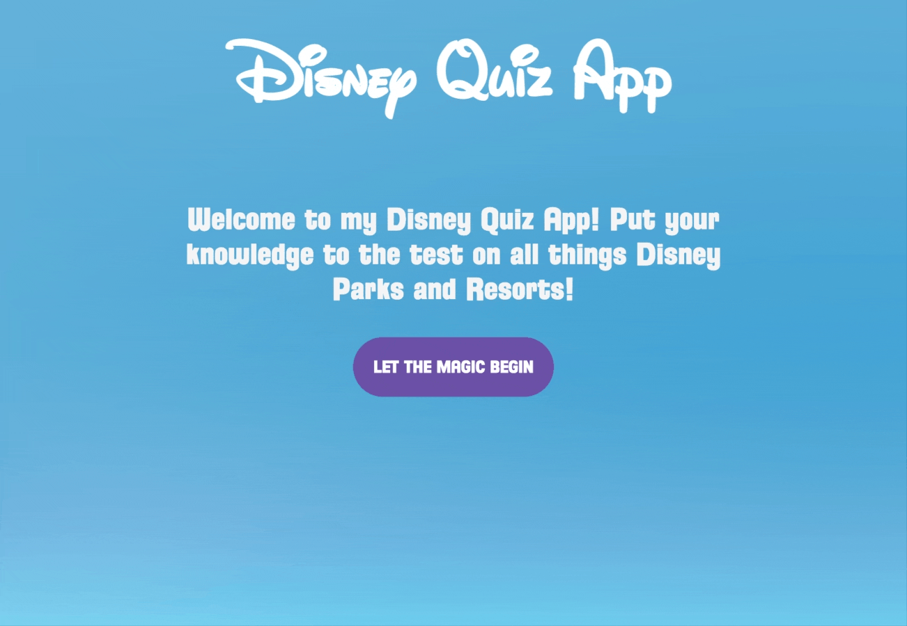

<!-- PROJECT LOGO -->
 

  

  <h3 align="center">Disney Quiz</h3>

  

    A short quiz app dedicated to one of my favorite subjects, Disney Parks!
     
     
    <a href="https://pete-sekesan.github.io/disney-quiz-app/">View Demo</a>
    ·
    <a href="https://github.com/Pete-Sekesan/disney-quiz-app/issues">Report Bug</a>
    ·
    <a href="https://github.com/Pete-Sekesan/disney-quiz-app/issues">Request Feature</a>
  

<!-- ABOUT THE PROJECT -->

## About The Project

This was one of my first assignments during my Software Engineering Boot Camp. The requirements were to create a short quiz app utilizing jQuery to render the questions with an answer STORE and to keep the running count of the players score.

### Built With

- [HTML](https://developer.mozilla.org/en-US/docs/Web/HTML)
- [CSS](https://developer.mozilla.org/en-US/docs/Web/CSS)
- [JavaScript](https://www.javascript.com/)
- [jQuery](https://jquery.com/)

<!-- USAGE EXAMPLES -->

## Usage

Use this app to test your Disney knowledge, or take a look at the source code to get an idea of how I utilized jQuery to create this application.

<!-- ROADMAP -->

## Roadmap

See the [open issues](https://github.com/Pete-Sekesan/disney-quiz-app/issues) for a list of proposed features (and known issues).

## Contact

Twitter - [@PeterSekesan](https://twitter.com/PeterSekesan)  
psekesan@gmail.com

Portfolio: https://peter-sekesan.dev

Project Link: [https://github.com/Pete-Sekesan/disney-quiz-app](https://github.com/Pete-Sekesan/disney-quiz-app)
